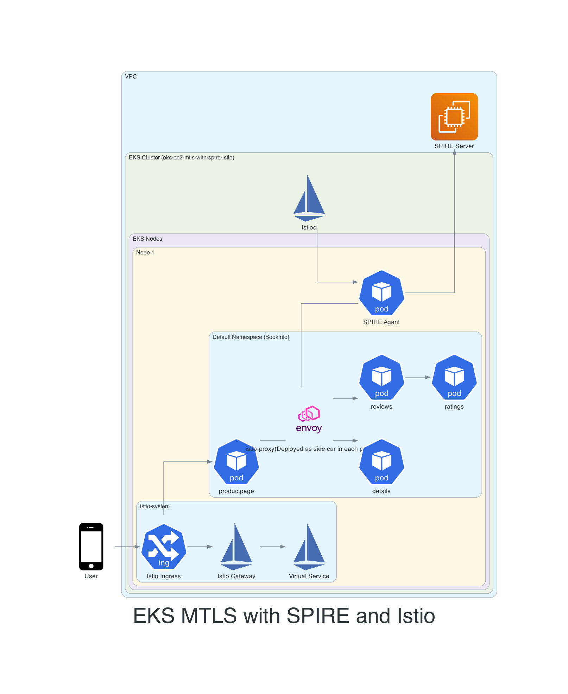

1. Terraform apply
2. helm upgrade --install -n spire-server spire-crds spire-crds --repo https://spiffe.github.io/helm-charts-hardened/ --create-namespace
3. helm upgrade spire helm-charts/spire -n spire-server -f spire-values.yaml   
4. kubectl apply -f /configs/spire/spire-server-config.yaml
5. ./kubeconfig.sh
6. copy above generate config and paste yaml in spire-kubeconfig.yaml
7. launch ec2 on same vpc as ec2 and run below cmds
wget https://github.com/spiffe/spire/releases/download/v1.11.1/spire-1.11.1-linux-amd64-musl.tar.gz
tar zvxf spire-1.11.1-linux-amd64-musl.tar.gz
sudo cp -r spire-1.11.1/. /opt/spire/
sudo useradd -r -s /bin/false spire  # create dedicated spire user
sudo chown -R spire:spire /opt/spire
sudo -u spire mkdir -p /opt/spire/data/server
sudo -u spire mkdir -p /opt/spire/conf
sudo -u spire mkdir -p /opt/spire/conf/kubeconfig

8. rum below cmds on ec2
curl https://bootstrap.pypa.io/get-pip.py | sudo python3

sudo pip install --upgrade awscli

9. place spire-server.config, spire-kubeconfig at their required paths on ec2
10. create  /etc/systemd/system/spire-server-service.service

11.  istioctl install -f configs/istio/istio.yaml

12. enable sidecar on default ns (kubectl label namespace default istio-injection=enabled)

13. deploy workload kubectl apply -f bookinfo.yaml

12. identify on which nodes the workload is placed and then create workload registration entries 

13. 

# kubectl - with an install script I made
curl https://raw.githubusercontent.com/omerh/scripts/master/upgrade_kubectl.sh | sudo bash

